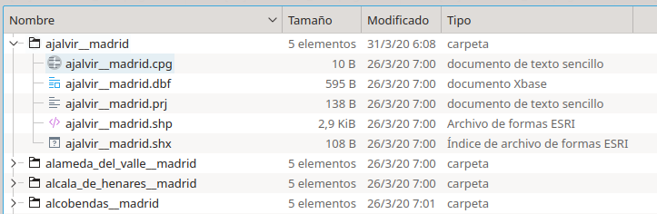
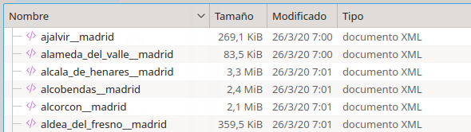
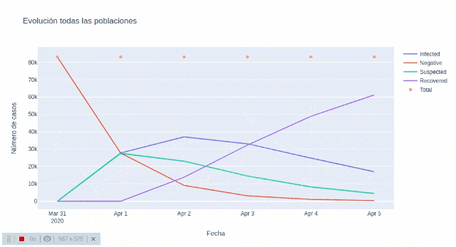

## covid19-data-visualization

Data generation, analysis and visualización COVID-19 Comunidad de Madrid.

**Disclaimer**: This software is for educational purposes only, without based on epidemiology.
if you want more information about COVID-19, see [Ministerio de Sanidad, Consumo y Bienestar Social](https://www.mscbs.gob.es/profesionales/saludPublica/ccayes/alertasActual/nCov-China/home.htm)

**Tech stack**:
- [OSMnx](https://github.com/gboeing/osmnx):  Python for street networks. Retrieve, model, analyze, and visualize
 street networks and other spatial data from OpenStreetMap.
- [Folium](https://python-visualization.github.io/folium/): builds on the data wrangling strengths of the Python ecosystem and the mapping strengths of the Leaflet.js library.
- [Plotly](https://plotly.com/): The interactive graphing library.
- [Pandas](https://pandas.pydata.org/): data analysis and manipulation tool.
- [GeoPandas](https://geopandas.org/):  extends the datatypes used by pandas to allow spatial operations on geometric types.
- [Jupyter Notebook](https://jupyter.org/): Project Jupyter exists to develop open-source software, open-standards, and services for interactive computing across dozens of programming languages.

### Setup

```bash
# Install python dependencies
make install
```

### Creating Jupyter environment
```bash
make run-jupyter
```
[Access to Jupyter Notebook](http://localhost:8888/tree)

### Notebooks
- [Preload OpenStreetMap (**first step**)](http://localhost:8888/notebooks/notebook_preload_openstreetmap.ipynb
): build maps and street networks.

    

    

- [Preload Datasets (**second step**)](http://localhost:8888/notebooks/notebook_preload_datasets.ipynb): Build random
 data by
 population, simulations and data manipulation.

 - [Maps visualization](http://localhost:8888/notebooks/notebook_preload_datasets.ipynb): OpenStreetMaps visualizations.

    

 - [Graph visualization](http://localhost:8888/notebooks/notebook_preload_datasets.ipynb): Plotly visualizations.

    

### License

This project is licensed under the [GPLv3](https://github.com/MacPass/KeePassKit/blob/master/Licenses/GPLv3.license.txt) - see the LICENSE.md file for details
